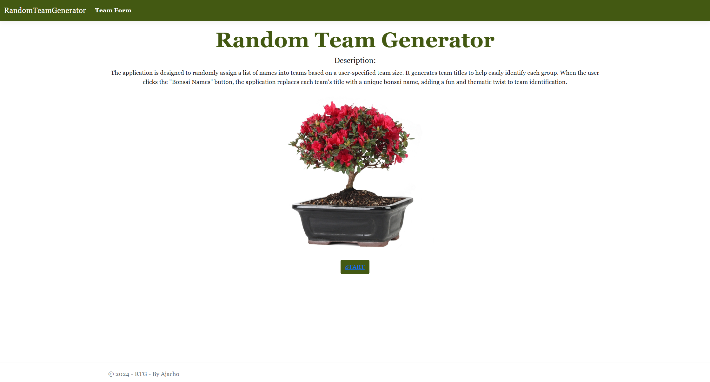

# RandomTeamGenerator

## Description

This application allows users to divide people into teams of a desired size. Simply navigate to the "Team Form" or click the "Start" button, enter the names, and the application will randomly assign them to teams. You can also give each team a random bonsai-themed name.

This project demonstrates key programming principles and problem-solving skills as required by the assignment.