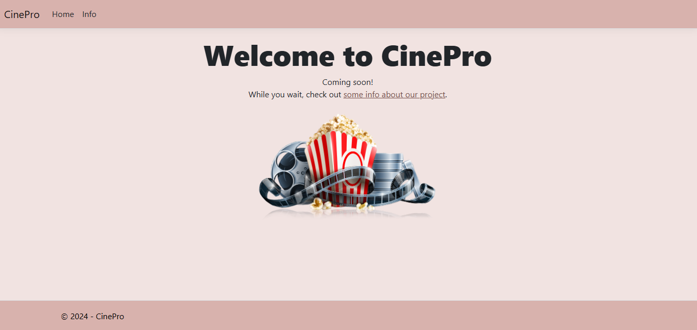

# CinePro

CineProject is a web application for exploring streaming media shows, including movies and TV series. It is built with ASP.NET Core MVC and uses Entity Framework Core for data access. The project features:

- **Home Page:** Welcomes users to CinePro and provides a brief introduction.
- **Info Page:** Displays statistics about the shows in the database, such as:
  - Total number of shows
  - Number of movies and TV shows
  - Most popular show on TMDB
  - Show with the most IMDB votes

## Technologies Used

- ASP.NET Core MVC
- Entity Framework Core
- SQL Server
- Bootstrap (for styling)
- jQuery and validation libraries

## Project Structure

- `Controllers/`: Handles HTTP requests and application logic.
- `Models/`: Database entity definitions.
- `DAL/`: Data access layer with repository pattern.
- `Views/`: Razor views for UI.
- `wwwroot/`: Static files (CSS, JS, images).

## Getting Started

1. Clone the repository.
2. Set up your SQL Server connection string in `appsettings.json`.
3. Run the application using `dotnet run` or through Visual Studio.
