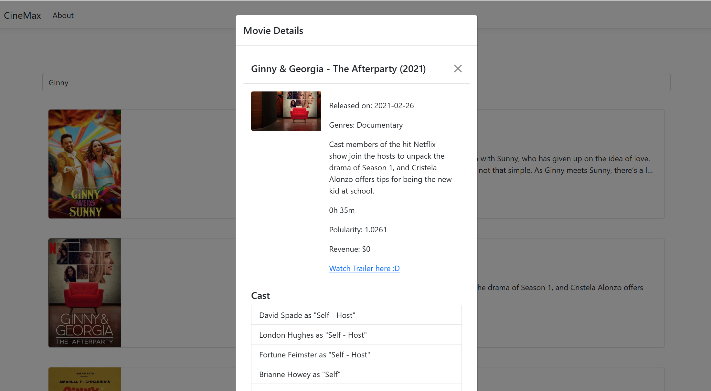

# Movie Explorer Web App

## Description

Movie Explorer is a web application that allows users to search for and explore movie information powered by The Movie Database (TMDB) API. Users can search for movies by title, view details such as release date, cast, and synopsis, and discover trending and top-rated films. The app provides a responsive and interactive user experience, making it easy to find and browse movies of interest.

## Technologies Used

- ASP.NET Core (C#)
- TMDB API (The Movie Database)
- JSON & AJAX
- jQuery
- Behavior-Driven Development (BDD)

## Features

- **Movie Search:** Search for movies by title using data from TMDB.
- **Detailed Movie Pages:** View comprehensive information about each movie, including plot, cast, poster, and ratings.
- **Trending & Top-Rated:** Discover trending and top-rated movies.
- **Asynchronous Updates:** Uses AJAX and JSON for dynamic page updates and seamless user experience.
- **BDD Testing:** Application logic and user stories are validated with automated BDD-style tests.

## How It Works

1. **User Interaction:** Users enter search queries or browse trending/top-rated lists.
2. **AJAX Requests:** The frontend sends AJAX requests to the backend server.
3. **TMDB API Integration:** The backend communicates with the TMDB REST API to fetch movie data, parsing JSON responses in C#.
4. **JSON Data Handling:** The server generates and returns JSON data to the frontend.
5. **Dynamic UI Updates:** jQuery updates the UI dynamically based on server responses.
6. **Testing:** BDD tests ensure all user stories and features work as described.

## Setup & Usage

1. Clone the repository.
2. Obtain an API key from [The Movie Database (TMDB)](https://www.themoviedb.org/documentation/api).
3. Configure your API key in the project (see `appsettings.json` or environment variables).
4. Build and run the ASP.NET Core application.
5. Open your browser and navigate to the provided URL to start exploring movies!

## License

This project is licensed under the MIT License.

---

**Note:** This application uses the TMDB API but is not endorsed or certified by TMDB.